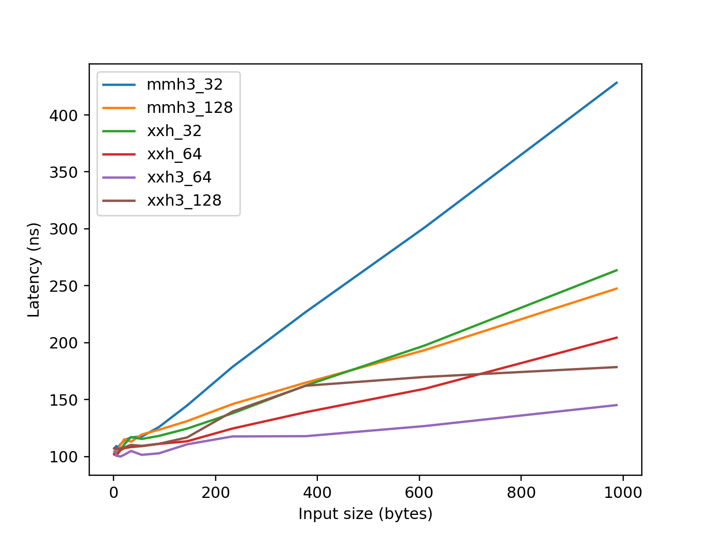

<!-- markdownlint-disable single-h1 -->

# Summary

In recent years, artificial intelligence (AI) has rapidly evolved, particularly
in natural language processing (NLP) with services like OpenAI's ChatGPT.
Likewise, the Internet of Things (IoT) continues to grow as a key area of
ubiquitous computing, exemplified by Shodan, the first IoT search engine.

Underlying these advancements are high-performance algorithms and data
structures relying on non-cryptographic hash functions, which are
characteristically fast, produce statistically well-distributed bits, exhibit
an avalanche effect (where a one-bit change in the input alters at least half
of the output), and are collision resistant. Because cryptographic strength is
unnecessary in these cases, they benefit from the efficiency of
non-cryptographic hashes.

MurmurHash3 and its test suite, SMHasher, was developed
by @appleby_murmurhash3_2011 and is one of the earliest and most continuously
popular hash functions specifically designed to implement the characteristics
mentioned above.

`mmh3` was launched in 2011 as a Python extension for MurmurHash3 and has been
maintained ever since. Its API is simple to use for Python programmers,
as it offers both one-shot hash functions and hasher classes that allow
incremental updating, whose methods are compliant to `hashlib`, a part of the
Python Standard Library. The library provides Python wheels (i.e., pre-built
binary packages) for immediate use on various platforms, including Linux
(x86_64, aarch64, i686, ppc64le, and s390x), Windows (win32, win_amd64,
and win_arm64), and macOS (Intel Mac and Apple Silicon). From version 4.0.0,
`mmh3` has been published under the MIT License, an OSI-approved permissive
open-source license.

As of September 1, 2024, `mmh3` was being downloaded more than 4 million times
per month, and it ranks as the 973th most downloaded PyPI package
(of around 566,000 projects), showing that only 0.17% of the remaining packages
in the PyPI ecosystem are more popular [@hugo_van_kemenade_2024_13624792].
According to PePy, as of September 1, 2024, the total downloads of
this library exceeded 130 millions.

Libraries and organizations that use `mmh3` include
Shodan, Microsoft Azure SDK for Python,
Apache Iceberg (open table format for analytic datasets),
Feast (feature store for machine learning),
PyMilvus (Python SDK for Milvus, an open-source vector database),
and pocsuite3 (open-source remote vulnerability testing framework).

# Statement of need

## AI and High-Performance Computing

AI is one of the most resource-demanding fields in computer science
and engineering. To mitigate this problem, various techniques are employed
under main systems, in which non-cryptographic hash functions play key roles
in a number of algorithms and data structures.

A notable technique is _feature hashing_ [@Weinberger2009; @Shi2009]. In its
simplest usage, when given a string-indexed data vector, it converts the
vector into an integer-indexed data vector in which each index is the hash
result of the original string index; collision values are summed.
Despite its simple and intuitive usage, a machine-learning process with feature
hashing is statistically guaranteed to be nearly as accurate as its original
process. Feature hashing has been shown to be useful for various situations,
including K-means clustering [@Senuma2011]
and succinct model learning [@Senuma2016].

Other popular techniques that leverage non-cryptographic hash functions include
_Bloom Filter_ [@Bloom1970], a compact data structure that tests whether an
element is a member of a certain set (with false positive matches), and
_MinHash_ [@Broder1997a], an algorithm that quickly estimates the similarity of
two sets.

`mmh3` appears in scholarly papers on various topics,
including Indian language NLP suites [@kakwani_indicnlpsuite_2020],
a secure system based on probabilistic structures [@adja_blockchain-based_2021],
as well as secure ciphertext deduplication in cloud storage [@Tang2024].
It has also appeared in technical books and computer science texts
[@gorelick_high_2020; @kumar_probabilistic_2021; @medjedovic_algorithms_2022].

## Internet of Things

`mmh3` is applicable to the IoT field. According to @shodan_its_2021,
Shodan [@Matherly2017] uses `mmh3` as its fingerprint for a favicon (i.e., an
icon associated with a web page or website). @Matherly2024 explained
the adoption of `mmh3` due to its speed and compact hash size,
noting that cryptographic guarantees provided by `md5` and other hashes were
not necessary for their use case. ZoomEye, another popular IoT search engine,
follows Shodan’s convention.

For cybersecurity, @kopriva_hunting_2021 reported a method of discovering
possible phishing websites by searching websites with Shodan, whose favicon’s
`mmh3` hash value was the same as that of a genuine one. Another use case of
`mmh3` in this area includes open-source intelligence (OSINT) activities,
such as measuring the popularity of web frameworks
and servers, as some users do not change their default favicon settings
specified by applications [@faraday_security_understanding_2022].

# Related software

`PYMMH` [@kihlander_pymmh3_2013] is a pure Python implementation of the
MurmurHash3 algorithms. Among various other Python bindings for
non-cryptographic hashes, `python-xxhash` by Yue Du [@du_xxhash_2014] is another
popular hash library, featuring xxHash developed by
Yan Collet [@collet_xxhash_2014].

# Benchmarks

We conducted microbenchmarking experiments to compare the efficiency of
Python-C hash libraries, balancing accuracy, reproducibility, and
reliability. Our methodology follows practices from microbenchmarking
literature, including works by @Peters2002, @Stinner2016,
@collet_xxhash_comparison_2020, @gorelick_high_2020, @RodriguezGuerra2021,
and @Bernhardt2023.

\autoref{bandwidth} and \autoref{latency} summarize the benchmarking results.
While the `xxh3` family in `python-xxhash 3.5.0` shows superior
performance for large inputs, the `mmh3 5.0.0` implementation excels with
smaller inputs (common scenarios for non-cryptographic hashes), due to its use
of `METH_FASTCALL`, an overhead-reducing interface introduced in Python 3.7.

For details, see the documentation of the project:
<https://mmh3.readthedocs.io/en/stable/benchmark.html>.
Additionally, the benchmarking results are publicly available as JSON files in
the repository: <https://github.com/hajimes/mmh3-benchmarks>.

<!-- markdownlint-capture -->
<!-- markdownlint-disable line-length -->

: \label{bandwidth}Benchmarking results for Python extensions. Small data
velocity is defined as the inverse of the mean latency (in microseconds) for
inputs in the range of 1–256 bytes. Collet (2020) refers to the results
of original C implementations experimented by the author of xxHash, using a CPU
clocked at 3.6–4.9 GHz (ours: 2.4–3.3 GHz).

| Hash         |    Width | Bandwidth       | Small Data Velocity | cf. Collet (2020) |
| :----------- | -------: | :-------------- | ------------------: | :---------------- |
| xxh3_128     | 128 bits | **22.42 GiB/s** |                8.96 | 29.6 GiB/s        |
| xxh3_64      |  64 bits | 22.41 GiB/s     |                 9.5 | 31.5 GiB/s        |
| xxh_64       |  64 bits | 8.90 GiB/s      |                 9.3 | 9.1 GiB/s         |
| **mmh3_128** | 128 bits | 6.91 GiB/s      |           **19.04** | N/A               |
| xxh_32       |  32 bits | 6.15 GiB/s      |                8.91 | 9.7 GiB/s         |
| **mmh3_32**  |  32 bits | 2.86 GiB/s      |               18.41 | 3.9 GiB/s         |
| sha1         |  16 bits | 1.63 GiB/s      |                 2.4 | 0.8 GiB/s         |
| md5          | 128 bits | 0.65 GiB/s      |                1.95 | 0.6 GiB/s         |

<!-- markdownlint-restore -->

# Acknowledgements

The author extends sincere gratitude to Akiko Aizawa for her helpful comments
on this paper. Appreciation is also given to all those involved in the
development and maintenance of `mmh3`. Special thanks go to Micha Gorelick,
who made the first pull request to the project and later introduced the
library in her technical book [@gorelick_high_2020].

# References
